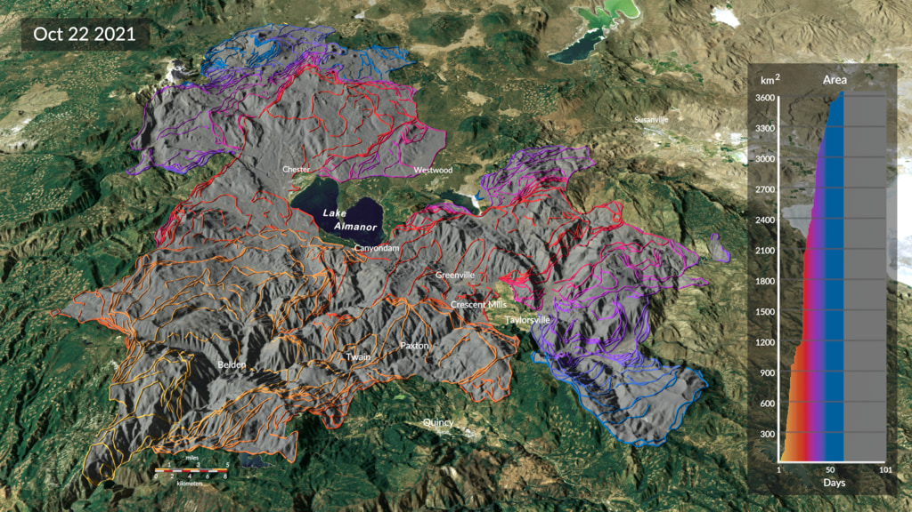

## Our Work 

We seek to understand how global fire activity alters ecosystems, contributes to greenhouse gas emissions, and affects air quality. Detecting and tracking individual fire events using satellite data improves our understanding of fires in the Earth system, including new extremes in fire behavior in a warmer, more flammable world. 

Our approach tracks the growth and intensity of individual fires every 12 hours using satellite active fire data. In contrast to active fire pixels or gridded burned area data, fire tracking clusters individual active fire detections in space and time and treats them as discrete objects that persist, expand, and evolve together. This “event-based” tracking strategy allows for detailed monitoring of large fires as they spread across a landscape. 

Our team analyzes fire tracking data to characterize the behavior of individual fires, evaluate regional and seasonal patterns of fire activity, and quantify fire emissions. 

## Data 
Our team develops and maintains the Fire Event Data Suite, or FEDS. The FEDS algorithm [(Chen et al., 2022)](https://www.nature.com/articles/s41597-022-01343-0/) uses an alpha shape approach to estimate the perimeter and properties of ongoing fire events every 12 hours, based on Visible Infrared Imaging Radiometer Suite (VIIRS) 375 m active fire detections.

This site contains more information about the [FEDS data](data_overview.qmd), available platforms for FEDS fire tracking [visualization and data access](nrt.qmd), as well as [publications](published_dataset.qmd), developer information, and technical documentation. 

The FEDS code is open source and available [on GitHub](https://github.com/Earth-Information-System/fireatlas). 

## Our Team 
FEDS is developed and maintained by scientists at NASA’s Goddard Space Flight Center and the University of California, Irvine.  See our [Team](team.qmd) page for more information on current team members, alumni, and collaborators.

To contact the science team by email, please use [this form](https://forms.gle/vHX7FvHhamDVRDHn9). 

