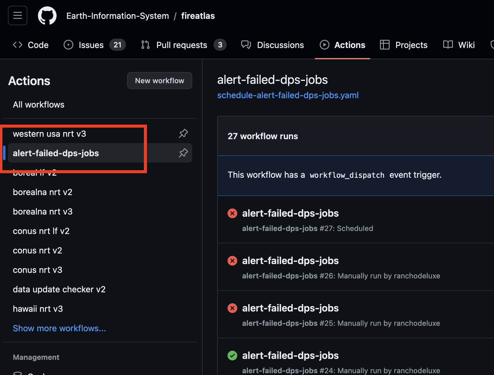
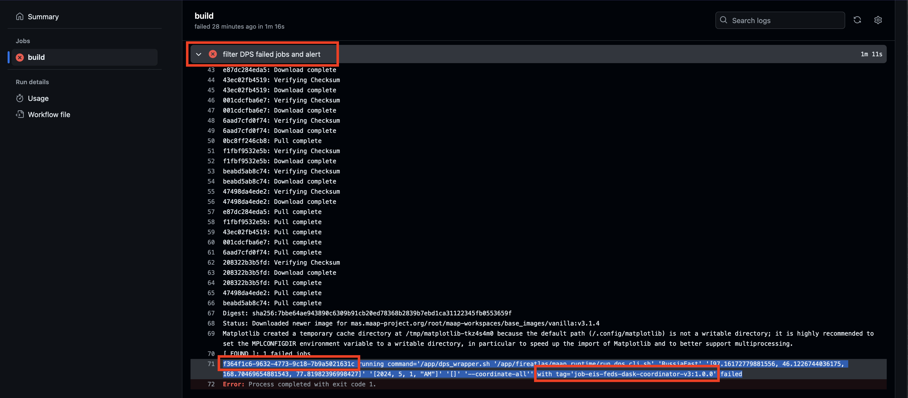

---
title: DPS Debugging Playbook
author: GC
--- 

Here are a series of steps that can help find out where something is failing regardless of whether the job is `"completed"`
or `"failed"` state from the DPS perspective.

### DPS Job UI/UX:

All resolution routes will eventually lead us to use the DPS Job UI/UX so let's make sure we have this workspace set up 
in the ADE:

```yaml
apiVersion: 1.0.0
metadata:
  name: dps-job-management
attributes:
  editorFree: 'true'
components:
  - endpoints:
      - attributes:
          type: ide
          discoverable: 'false'
          path: /
          protocol: http
          public: 'true'
        name: jupyter
        port: 3100
    referenceContent: |
      kind: List
      items:
        - apiVersion: v1
          kind: Pod
          metadata:
            name: ws
            labels:
              ssh: enabled
          spec:
            containers:
              - name: jupyter
                image: 'mas.dit.maap-project.org/root/maap-workspaces/hysds-proxy:ops'
                imagePullPolicy: Always
                resources:
                  limits:
                    memory: 8096Mi
    type: kubernetes
```

### I Think a Job is Failing:

Step one, we need metadata about a job to find it in the DPS Job UI/UX above. Since GH Actions are the interface to kicking off all manual jobs or scheduled jobs
then that's where we'll go to figure everything out.

There are two paths to resolution here. Both are expanded on in the sections below:

1. find the GH Action that kicked off the job


2. find any failing jobs that ended within the last hour using the GH Action `"schedule-alert-failed-dps-jobs"`

### GH Action That Kicked Off A Job

If used the `manual` GH Action to kick off a job or if the job was scheduled we can go find it in the [GH Actions UI](https://github.com/Earth-Information-System/fireatlas/actions). Note that you can filter for all job
runs of the job you want to find by clicking the left-handed nav highlighted in red below:


Find the most recent scheduled job or the manual job you kicked off and then click through to see the job steps. The step that dumps out job metadata is called
`"kick off DPS job"` as highlighted in red below. Also highlighted in red are the two most important pieces of metadata information to retrieve about the job: the algorithm name, algorithm version and the job id:


### GH Action Alert Failed DPS Jobs

Click on the `"alert-failed-dps-jobs"` GH Action in the left-handed nav of actions to see most recent runs. This action runs every hour
and sniffs for jobs that failed with an end time within the past hour. Actions that detect faild jobs should be red as opposed to green:


Click on a red action and drill down to the step that dumps out job metadata is called
`"filter DPS failed jobs and alert"` as highlighted in red below. Also highlighted in red are the two most important pieces of metadata information to retrieve about the job: the algorithm name, algorithm version and the job id:



### Go to DPS UI/UX And Filter For Job

The easiest way to find a job is using the algorithm name and version and then using the job id to verify its correct. Go to the DPS Job UI/UX and


If a DPS job is in the `"failed"` state it should have a clear traceback listed in the job card. If it is in the `"completed"` state then you should be able
to click through in the job card under `"View Job"` and look at the `_stderr.txt` and `running.log` in outputs for more information